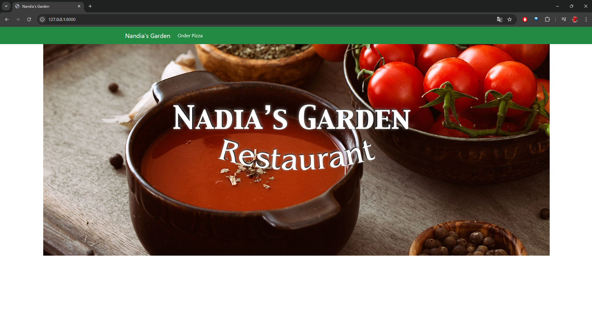
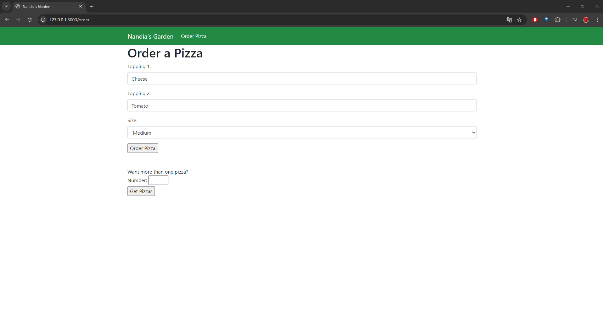
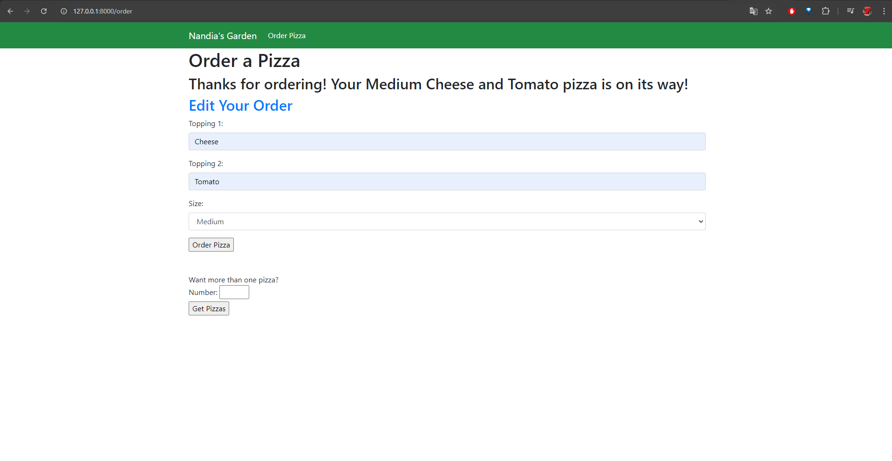

---
The goal of the project was to explore and learn more about Django forms. The project consists of a pizza ordering system, where users can select two toppings and choose the size. Users can also update their orders.
---

